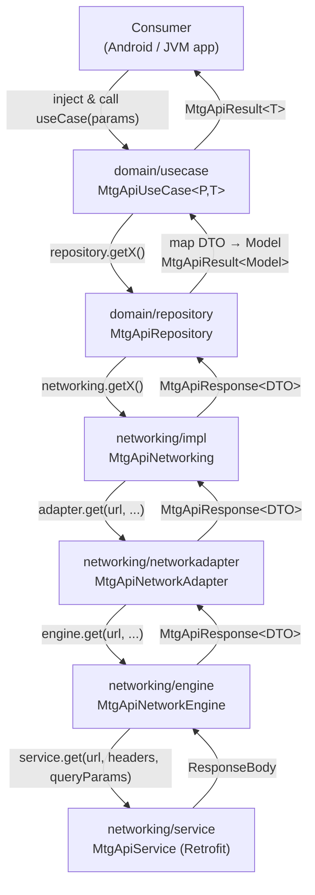
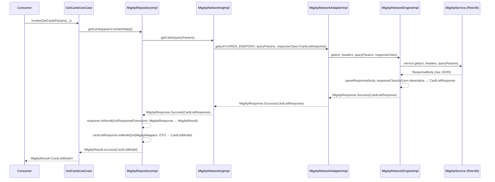

# Architecture Overview

This document describes the internal structure of the MTG API Kotlin SDK — how the layers are organized, how data flows from an API call to a domain result, how Koin modules are composed, and how to extend or add to the SDK.

**Audience:** SDK contributors and advanced users.

---

## Table of Contents

1. [Directory Structure](#directory-structure)
2. [Layer Responsibilities](#layer-responsibilities)
3. [Data Flow](#data-flow)
4. [Koin DI Structure](#koin-di-structure)
5. [Extension Points](#extension-points)
6. [Adding a New Endpoint](#adding-a-new-endpoint)

---

## Directory Structure

```
com.rikezero.mtgapi_kotlin_sdk/
│
├── di/                         # Koin module composition & library entry point
│
├── domain/                     # Business logic — models, use cases, repository contract
│   ├── failure/                # MtgApiFailure sealed class hierarchy
│   ├── mappers/                # Response DTO → Domain model conversions
│   ├── model/                  # Domain entities (CardModel, CardSetModel, etc.)
│   ├── repository/             # MtgApiRepository interface + MtgApiRepositoryImpl
│   ├── result/                 # MtgApiResult<T> success/failure wrapper
│   └── usecase/                # Public use case classes + MtgApiUseCase<P,T> base
│
├── networking/                 # HTTP layer — Retrofit service, DTOs, deserialization
│   ├── deserializer/           # Gson configuration singleton (MtgApiDeserializer)
│   ├── engine/                 # MtgApiNetworkEngine interface + Retrofit/OkHttp impl
│   ├── impl/                   # MtgApiNetworkingImpl — maps endpoints to service calls
│   ├── networkadapter/         # MtgApiNetworkAdapter interface + passthrough impl
│   ├── response/               # Network response DTOs (CardResponse, MtgApiResponse, etc.)
│   └── service/                # MtgApiService — Retrofit @GET interface
│
├── samples/                    # Standalone runnable samples for every endpoint
│
└── util/
    └── response/               # ResponseExtensions — MtgApiResponse → MtgApiResult
```

---

## Layer Responsibilities



| Layer | Package | Responsibility |
|---|---|---|
| **UseCase** | `domain/usecase/` | Consumer entry point. Each use case wraps exactly one repository method. Extend `MtgApiUseCase<P, T>` and override `execute(params)`. |
| **Repository** | `domain/repository/` | Contract isolating networking from domain. `MtgApiRepository` defines the interface; `MtgApiRepositoryImpl` calls networking and applies mappers. |
| **Networking** | `networking/impl/` | Maps named SDK operations to HTTP calls via `MtgApiNetworkAdapter`. Owns endpoint URL constants. |
| **Network Adapter / Engine** | `networking/networkadapter/` + `networking/engine/` | Abstraction over the raw HTTP client. `MtgApiNetworkAdapter` is the boundary; `MtgApiNetworkEngine` holds the Retrofit instance. Swapping the engine does not affect any layer above the adapter. |
| **DI** | `di/` | Koin module composition. Three private sub-modules wired together and exposed via `startMtgApiLibrary()`. |

---

## Data Flow

The sequence below uses `GetCardsUseCase` as the example. All other use cases follow the same path.



**Key conversion points:**

- `ResponseExtensions.toResult()` — converts `MtgApiResponse<T>` to `MtgApiResult<T>`, wrapping errors as `MtgApiFailure`
- `MtgApiMappers` — pure functions mapping each response DTO to its domain model (e.g., `CardListResponse.toModel()`)

---

## Koin DI Structure

`startMtgApiLibrary()` is the single public entry point. It calls `loadKoinModules()` with three private modules:

```
mtgApiLibraryModules = [
    mtgApiNetworkingModules,     // Retrofit, OkHttp, Engine, Adapter, Networking
    mtgApiRepositoryModules,     // MtgApiRepository → MtgApiRepositoryImpl
    mtgApiUseCaseModules         // All 8 use cases
]
```

**Dependency chain (Koin resolution order):**

```
GetCardsUseCase
  └─ MtgApiRepository (→ MtgApiRepositoryImpl)
       └─ MtgApiNetworking (→ MtgApiNetworkingImpl)
            └─ MtgApiNetworkAdapter (→ MtgApiNetworkAdapterImpl)
                 └─ MtgApiNetworkEngine (→ MtgApiNetworkEngineImpl)
                      └─ Retrofit (named "retrofit_mtgapi")
```

**Initialization contract:**

1. Call `startKoin { }` with your own modules first.
2. Call `startMtgApiLibrary()` — loads SDK modules into the running Koin instance.
3. Load your own modules that inject SDK use cases (e.g., `GetCardsUseCase`).

---

## Extension Points

### 1. OkHttp Interceptors

Add logging, authentication, or caching interceptors by passing them to `buildMtgApiRetrofit()` inside a custom `MtgApiNetworkEngine` binding:

```kotlin
single<MtgApiNetworkEngine> {
    MtgApiNetworkEngineImpl(
        retrofit = buildMtgApiRetrofit(
            host = BuildConfig.MAGIC_THE_GATHERING_BASE_URL,
            interceptors = listOf(
                HttpLoggingInterceptor().apply { level = HttpLoggingInterceptor.Level.BODY },
                MyAuthInterceptor()
            )
        )
    )
}
```

Register this binding after `startMtgApiLibrary()` to override the default engine.

### 2. Per-Request Custom Deserializer

`MtgApiNetworkAdapter.get()` accepts an optional `JsonDeserializer<T>` that overrides the default Gson config for a single call:

```kotlin
adapter.get(
    url = "v1/cards",
    responseClass = CardListResponse::class,
    deserializer = MyCardListDeserializer()
)
```

Useful when the API returns a non-standard envelope for a specific endpoint.

### 3. Custom Repository Implementation

Implement `MtgApiRepository` directly to swap the data source (e.g., add caching, stub for tests) without changing any use case:

```kotlin
class CachingMtgApiRepository(
    private val remote: MtgApiRepositoryImpl,
    private val cache: CardCache
) : MtgApiRepository {
    override suspend fun getCards(params: HashMap<String, String>) =
        cache.get(params) ?: remote.getCards(params).also { cache.put(params, it) }
    // ...
}
```

Bind it in Koin before loading your dependent modules.

### 4. Custom Use Case

Extend `MtgApiUseCase<P, T>` to add business logic on top of any repository call:

```kotlin
class GetDragonCardsUseCase(
    private val repository: MtgApiRepository
) : MtgApiUseCase<Unit, CardListModel>() {
    override suspend fun execute(params: Unit) =
        repository.getCards(hashMapOf("name" to "Dragon", "pageSize" to "20"))
}
```

Register it in your own Koin module — no changes to the SDK required.

---

## Adding a New Endpoint

Follow these steps in order. Each step names the layer and the file to create or edit.

| Step | Action | File |
|------|--------|------|
| 1 | **Create Response DTO** — mirror the API JSON structure | `networking/response/{domain}/{Name}Response.kt` (new) |
| 2 | **Create Domain Model** — clean entity, no JSON annotations | `domain/model/{domain}/{Name}Model.kt` (new) |
| 3 | **Add mapper function** — `{Name}Response.toModel()` | `domain/mappers/MtgApiMappers.kt` (edit) |
| 4 | **Add repository interface method** | `domain/repository/MtgApiRepository.kt` (edit) |
| 5 | **Implement repository method** — call networking, apply mapper | `domain/repository/impl/MtgApiRepositoryImpl.kt` (edit) |
| 6 | **Add networking interface method** | `networking/MtgApiNetworking.kt` (edit) |
| 7 | **Implement networking method** — add endpoint constant, call adapter | `networking/impl/MtgApiNetworkingImpl.kt` (edit) |
| 8 | **Add Retrofit service method** — `@GET` annotated suspend fun | `networking/service/MtgApiService.kt` (edit) |
| 9 | **Create UseCase** — extend `MtgApiUseCase<P, T>`, delegate to repository | `domain/usecase/Get{Name}UseCase.kt` (new) |
| 10 | **Register in Koin** — `single<Get{Name}UseCase> { Get{Name}UseCase(get()) }` | `di/MtgApiModule.kt` (edit) |

**Files touched per new endpoint:** 3 new, 7 edits.
