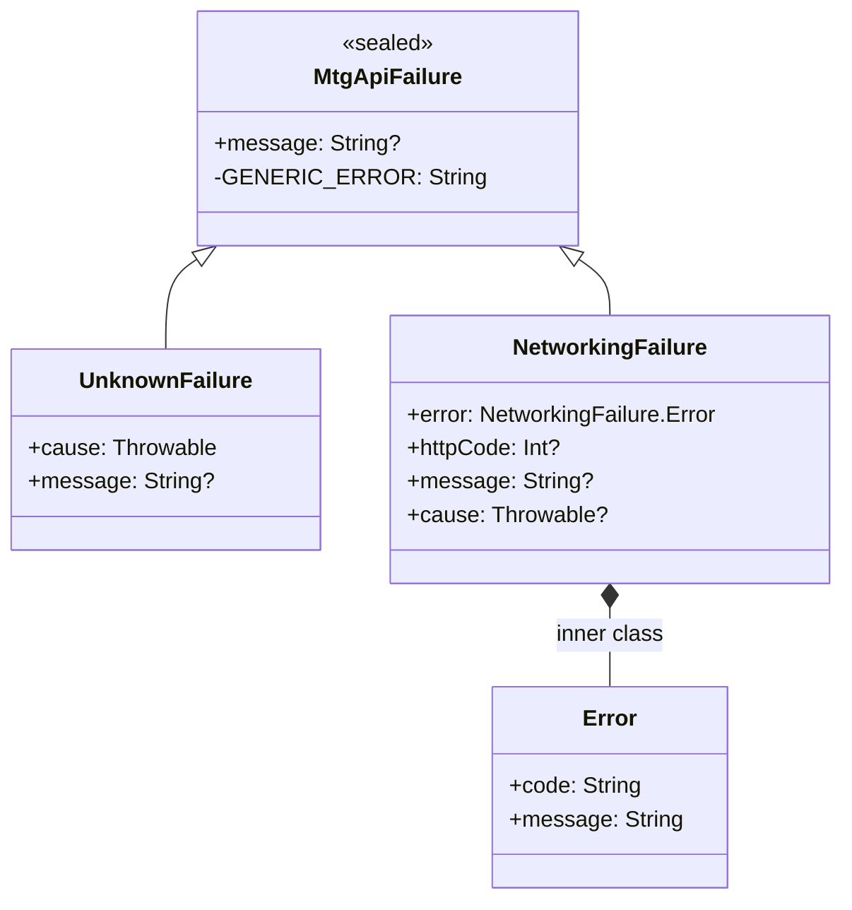

# Error Handling Guide

This guide covers how to handle errors when using the MTG API Kotlin SDK. All public APIs return
`MtgApiResult<T>`, which wraps either a successful value or an `MtgApiFailure`. `MtgApiResponse`
is an internal network-layer type and is never exposed to SDK consumers.

---

## 1. MtgApiFailure — Failure Hierarchy

`MtgApiFailure` is a sealed class that extends `Throwable`. Every failure the SDK surfaces is one
of its two concrete subtypes.



### Subtypes

| Subtype | When it occurs | Key fields |
|---|---|---|
| `UnknownFailure` | An unexpected exception was caught that has no structured HTTP context | `cause: Throwable`, optional `message: String?` |
| `NetworkingFailure` | The HTTP layer returned a structured error response | `error: NetworkingFailure.Error` (with `code` and `message`), optional `httpCode: Int?`, optional `message`, optional `cause` |

#### `NetworkingFailure.Error` — Inner Class

`NetworkingFailure` carries a nested `Error` object that holds the structured error body returned
by the API:

```kotlin
class Error(
    val code: String,    // machine-readable error code from the API
    val message: String  // human-readable error description from the API
)
```

#### `message` resolution

`MtgApiFailure` overrides `message` so it always returns a non-null string: if neither the
constructor argument nor `cause.message` is present, it falls back to the constant
`"An error has occurred"`.

---

## 2. MtgApiResult — Result Type

`MtgApiResult<R>` is an open generic class (not a typealias) that wraps either a successful value
or a `Throwable`. Internally it stores a single `value: Any?` field and uses its runtime type to
distinguish success from failure.

### Properties and extension functions

| Member | Kind | Description |
|---|---|---|
| `isSuccess: Boolean` | property | `true` when the wrapped value is not a `Throwable` |
| `isFailure: Boolean` | property | `true` when the wrapped value is a `Throwable` |
| `getOrNull(): R?` | method | Returns the success value, or `null` on failure |
| `exceptionOrNull(): Throwable?` | method | Returns the failure `Throwable`, or `null` on success |
| `onSuccess { }` | extension fun | Runs the block with the success value; returns `this` for chaining |
| `onFailure { }` | extension fun | Runs the block with the `Throwable`; returns `this` for chaining |
| `map { }` | extension fun | Transforms the success value; propagates failure unchanged |
| `mapToNotNull { }` | extension fun | Like `map`, but throws `UnknownFailure(NullPointerException())` if the success value is `null` |

#### Companion factory functions

```kotlin
MtgApiResult.success(value)    // wrap a success
MtgApiResult.failure(throwable) // wrap a failure
```

### Basic usage — onSuccess / onFailure chaining

```kotlin
val result: MtgApiResult<List<Card>> = sdk.getCards()

result
    .onSuccess { cards ->
        println("Loaded ${cards.size} cards")
    }
    .onFailure { throwable ->
        println("Request failed: ${throwable.message}")
    }
```

---

## 3. Handling Patterns

### Pattern 1: onSuccess / onFailure chaining

Both callbacks are optional and the result is returned unchanged, so they compose cleanly.

```kotlin
sdk.getCard(id = "abc123")
    .onSuccess { card ->
        display(card)
    }
    .onFailure { error ->
        logError(error)
    }
```

### Pattern 2: isSuccess / isFailure + getOrNull / exceptionOrNull

Useful when you need the value or error in a variable rather than inside a lambda.

```kotlin
val result = sdk.getCard(id = "abc123")

if (result.isSuccess) {
    val card = result.getOrNull() ?: return
    display(card)
} else {
    val error = result.exceptionOrNull()
    logError(error)
}
```

### Pattern 3: Exhaustive typed `when` on MtgApiFailure subtypes

Cast `exceptionOrNull()` to `MtgApiFailure` and use a `when` expression to handle each concrete
subtype with access to its typed fields.

```kotlin
val result = sdk.getCard(id = "abc123")

result.onFailure { throwable ->
    when (val failure = throwable as? MtgApiFailure) {
        is MtgApiFailure.NetworkingFailure -> {
            val httpCode  = failure.httpCode    // e.g. 404, 500
            val apiCode   = failure.error.code  // machine-readable code from API body
            val apiMsg    = failure.error.message
            println("HTTP $httpCode — $apiCode: $apiMsg")
        }
        is MtgApiFailure.UnknownFailure -> {
            println("Unexpected error: ${failure.cause.message}")
        }
        null -> {
            // throwable is not an MtgApiFailure — handle generically
            println("Unknown throwable: ${throwable.message}")
        }
    }
}
```

### Pattern 4: map{} transformation

Transform the success value into a different type while propagating failures automatically.

```kotlin
val result: MtgApiResult<List<Card>> = sdk.getCards()

val names: MtgApiResult<List<String>> = result.map { cards ->
    cards.map { it.name }
}

names
    .onSuccess { cardNames -> showList(cardNames) }
    .onFailure { error -> showError(error.message) }
```

#### mapToNotNull — null-safe transformation

When the success value is nullable (`MtgApiResult<T?>`), use `mapToNotNull` to guarantee a
non-null `T` in the transform block. If the value is `null`, `mapToNotNull` automatically wraps
a `NullPointerException` in an `UnknownFailure` and converts the result to a failure — no extra
null check required.

```kotlin
val result: MtgApiResult<Card?> = sdk.getCard(id = "abc123")

val name: MtgApiResult<String> = result.mapToNotNull { card ->
    card.name // card is guaranteed non-null here
}
```

---

## 4. MtgApiResponse — Network Layer

`MtgApiResponse<T>` is a **sealed class used internally** by the SDK's networking layer. SDK
consumers never interact with it directly — all public APIs return `MtgApiResult<T>`.

### Internal variants

```kotlin
sealed class MtgApiResponse<out T> {
    data class Success<T>(val data: T) : MtgApiResponse<T>()
    data class Error(val exception: Exception) : MtgApiResponse<Nothing>()
}
```

### toResult() — conversion to MtgApiResult

The extension function `MtgApiResponse<T>.toResult()` (in `util.response`) bridges the internal
network layer to the public result type:

```kotlin
fun <T> MtgApiResponse<T>.toResult(): MtgApiResult<T> = when (this) {
    is MtgApiResponse.Success -> MtgApiResult.success(data)
    is MtgApiResponse.Error   -> MtgApiResult.failure(exception)
}
```

The `result { }` builder wraps this conversion with a `runCatching` guard so that any exception
thrown inside the block is also captured as a failure:

```kotlin
inline fun <T> result(block: () -> MtgApiResponse<T>): MtgApiResult<T> =
    runCatching { block().toResult() }
        .getOrElse { error -> MtgApiResult.failure(error) }
```

**Consumers receive `MtgApiResult<T>` only.** The conversion from `MtgApiResponse` to
`MtgApiResult` happens inside the SDK before a result is returned to the caller.

---

## 5. Best Practices for UI Integration

### Define a UI state sealed class

Keep `MtgApiFailure` out of your UI layer. Map SDK results into a UI-specific sealed class:

```kotlin
sealed class CardUiState {
    object Loading : CardUiState()
    data class Success(val cards: List<Card>) : CardUiState()
    data class Error(val message: String) : CardUiState()
}
```

### Map results in a ViewModel

```kotlin
class CardViewModel(private val sdk: MtgApiSdk) : ViewModel() {

    private val _uiState = MutableStateFlow<CardUiState>(CardUiState.Loading)
    val uiState: StateFlow<CardUiState> = _uiState.asStateFlow()

    fun loadCards() {
        viewModelScope.launch {
            _uiState.value = CardUiState.Loading

            sdk.getCards()
                .onSuccess { cards ->
                    _uiState.value = CardUiState.Success(cards)
                }
                .onFailure { throwable ->
                    val message = when (val failure = throwable as? MtgApiFailure) {
                        is MtgApiFailure.NetworkingFailure -> toUserMessage(failure.httpCode)
                        is MtgApiFailure.UnknownFailure    -> "Something went wrong. Please try again."
                        null                               -> throwable.message ?: "Unknown error"
                    }
                    _uiState.value = CardUiState.Error(message)
                }
        }
    }

    private fun toUserMessage(httpCode: Int?): String = when (httpCode) {
        400  -> "Bad request. Check your search parameters."
        401  -> "Authentication failed."
        404  -> "No results found."
        429  -> "Too many requests. Please wait a moment."
        in 500..599 -> "Server error. Try again later."
        else -> "Network error (HTTP $httpCode)."
    }
}
```

### Key rules

- **Do not expose `MtgApiFailure` to the UI layer.** Convert it to a user-facing string or a
  domain-level error enum before updating UI state.
- Translate `httpCode` to human-readable strings in the ViewModel, not in a Composable or Fragment.
- Use `Loading` / `Success` / `Error` states (or equivalent) so the UI is always in a defined,
  renderable state.
- Prefer `onSuccess` / `onFailure` chaining for concise ViewModel code; reserve exhaustive `when`
  for cases where you need to differentiate between `NetworkingFailure` and `UnknownFailure`.
